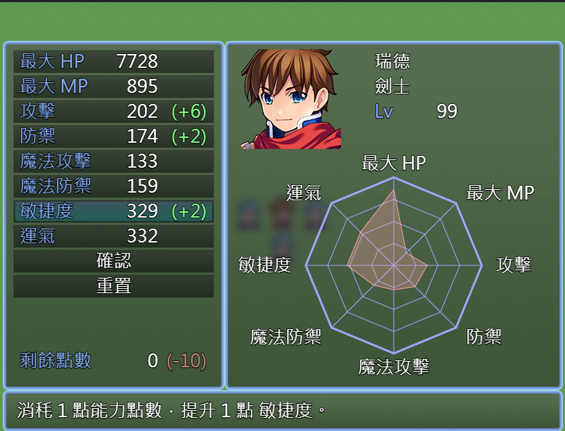

# ParamDistribution

This plugin for RPG Maker MZ allows developers to implement a custom parameter (stats) distribution system for actors. Players can allocate points to their characters' parameters (such as MaxHP, MaxMP, Attack, Defense, etc.) according to their preference, enhancing the customization and strategy elements of the game.

## Plugin parameters:

-   Text
    -   Param distribution: str
    -   Param points: str
    -   Done: str
    -   Reset: str
    -   Help text for each param: str
-   maxParams: list of number
-   gainPerStep: list of number
-   costPerStep: list of number
-   gainPerLevel: number

## Plugin commands:

-   Operate param points
    params:
    -   Actor: actor
    -   Operation: select
    -   Points: number
